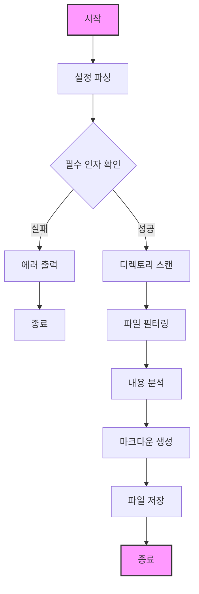

# CodeMD (Auto Index Markdown Generator)

자동으로 프로젝트의 디렉토리 구조를 분석하여 마크다운 문서를 생성하는 도구입니다.

## 주요 기능
- 지정된 확장자의 파일만 필터링 (예: .go, .java)
- 특정 디렉토리 제외 기능 (예: vendor, node_modules)
- 커스텀 출력 경로 지정
- 재귀적 디렉토리 탐색
- 숨김 파일/디렉토리 처리

## 프로세스 Flow



## 설치 방법

### 소스코드에서 빌드
```bash
# 프로젝트 클론
git clone https://github.com/kihyun1998/codemd.git

# 프로젝트 디렉토리로 이동
cd codemd

# 빌드 
go build -o codemd ./cmd/codemd

# 다양한 환경에서 빌드(cmd)
GOOS=linux GOARCH=amd64 go build -o codemd-linux-amd64 ./cmd/codemd
GOOS=darwin GOARCH=amd64 go build -o codemd-darwin-amd64 ./cmd/codemd
GOOS=windows GOARCH=amd64 go build -o codemd-windows-amd64.exe ./cmd/codemd

# 다양한 환경에서 빌드(powershell)
$env:GOOS="linux"; $env:GOARCH="amd64"; go build -o ./build/codemd-linux-amd64 ./cmd/codemd
$env:GOOS="darwin"; $env:GOARCH="amd64"; go build -o ./build/codemd-darwin-amd64 ./cmd/codemd
$env:GOOS="windows"; $env:GOARCH="amd64"; go build -o ./build/codemd-windows-amd64.exe ./cmd/codemd
```

### Go Install 사용
```bash
go install github.com/kihyun1998/codemd@latest
```

## 사용법

### 기본 사용
```bash
codemd -type go
```

### 추가 옵션 사용
```bash
# 출력 경로 지정
codemd -type go -out docs/index.md

# 특정 디렉토리 제외
codemd -type go -exclude vendor,node_modules

# 여러 확장자 지정
codemd -type go,java,py -out docs/CODE.md
```

### 옵션 설명
- `-type`: 처리할 파일 확장자 (필수, 쉼표로 구분)
- `-out`: 출력 파일 경로 (기본값: CODE.md)
- `-exclude`: 제외할 디렉토리 (선택, 쉼표로 구분)

## 프로젝트 구조

```
codemd/
├── cmd/
│   └── codemd/            # 실행 파일 디렉토리
│       └── main.go        # 메인 진입점
├── internal/
│   ├── config/            # 설정 관련
│   │   ├── config.go      # 설정 구조체
│   │   └── loader.go      # 설정 로더
│   ├── generator/         # 마크다운 생성
│   │   ├── markdown.go    # 마크다운 생성기
│   │   └── template.go    # 템플릿 처리
│   └── parser/           # 파싱 관련
│       ├── errors.go      # 커스텀 에러 정의
│       ├── file.go        # 파일 파서
│       ├── directory.go   # 디렉토리 파서
│       └── parser.go      # 인터페이스 정의
├── pkg/
│   └── utils/            # 유틸리티
│       ├── file_utils.go  # 파일 관련
│       └── string_utils.go # 문자열 관련
└── test/                 # 테스트 코드
    ├── testdata/         # 테스트 데이터
    └── parser_test.go    # 파서 테스트
```

## 개발 환경
- Go 1.20 이상
- 모듈 기반 의존성 관리

## 테스트 실행
```bash
# 전체 테스트
go test ./...

# 특정 패키지 테스트
go test ./internal/parser
```

## 기여하기
1. Fork the Project
2. Create your Feature Branch
3. Commit your Changes
4. Push to the Branch
5. Open a Pull Request

## 라이선스
MIT License

## 작성자
- kihyun1998