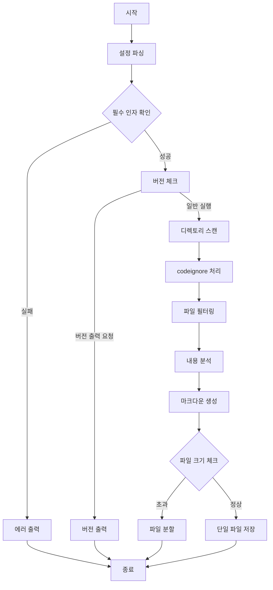

# CodeMD (Auto Index Markdown Generator)

자동으로 프로젝트의 디렉토리 구조를 분석하여 마크다운 문서를 생성하는 도구입니다.

## 주요 기능
- 지정된 확장자의 파일만 필터링 (예: .go, .java)
- 특정 디렉토리 제외 기능 (예: vendor, node_modules)
- 커스텀 출력 경로 지정
- 재귀적 디렉토리 탐색
- 숨김 파일/디렉토리 처리
- 대용량 파일 자동 분할 (NEW)
  - 설정 가능한 최대 파일 크기
  - 자동 파일 분할 및 넘버링
  - 메모리 효율적 처리

## 프로세스 Flow



## 설치 방법

### 소스코드에서 빌드
```bash
# 프로젝트 클론
git clone https://github.com/kihyun1998/codemd.git

# 프로젝트 디렉토리로 이동
cd codemd

# 빌드 
go build -o codemd.exe ./cmd/codemd

# 다양한 환경에서 빌드(cmd)
GOOS=linux GOARCH=amd64 go build -o codemd-linux-amd64 ./cmd/codemd
GOOS=darwin GOARCH=amd64 go build -o codemd-darwin-amd64 ./cmd/codemd
GOOS=windows GOARCH=amd64 go build -o codemd-windows-amd64.exe ./cmd/codemd

# 다양한 환경에서 빌드(powershell)
$env:GOOS="linux"; $env:GOARCH="amd64"; go build -o ./build/codemd-linux-amd64 ./cmd/codemd
$env:GOOS="darwin"; $env:GOARCH="amd64"; go build -o ./build/codemd-darwin-amd64 ./cmd/codemd
$env:GOOS="windows"; $env:GOARCH="amd64"; go build -o ./build/codemd-windows-amd64.exe ./cmd/codemd
```
## 사용법

### 기본 사용
```bash
# 모든 파일 처리
codemd

# 특정 확장자만 처리
codemd -type go

# 버전 확인
codemd -v
```

### 추가 옵션 사용
```bash
# 출력 경로 지정
codemd -type go -out docs/index.md

# 특정 디렉토리 제외
codemd -type go -exclude vendor,node_modules

# 여러 확장자 지정
codemd -type go,java,py -out docs/CODE.md

# 파일 크기 제한 설정 (MB 단위)
codemd -type go -maxsize 20
codemd -t go -m 15
```

### 옵션 설명
- `-type, -t`: 처리할 파일 확장자 (선택, 쉼표로 구분)
- `-out, -o`: 출력 파일 경로 (기본값: CODE.md)
- `-exclude, -e`: 제외할 디렉토리 (선택, 쉼표로 구분)
- `-version, -v`: 버전 정보 출력
- `-codeignore, -c`: .codeignore 파일 사용 여부 (기본값: false)
- `-maxsize, -m`: 출력 파일의 최대 크기 (MB 단위, 기본값: 10)

### 파일 분할 예시
큰 프로젝트의 경우 출력 파일이 자동으로 분할됩니다:
```bash
# 20MB 크기로 파일 분할 설정
codemd -type go -maxsize 20

# 결과 파일:
# CODE1.md (20MB)
# CODE2.md (20MB)
# CODE3.md (나머지)
```

[이전 테스트 실행 섹션...]

## 기여하기
1. Fork the Project
2. Create your Feature Branch
3. Commit your Changes
4. Push to the Branch
5. Open a Pull Request

## 라이선스
MIT License

## 작성자
- kihyun1998
