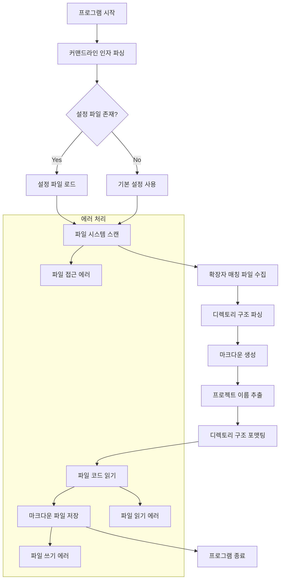

# aimd
🚀 Generate markdown file.

## 빌드하는 법

```bash
# 프로젝트 루트 디렉토리(E:\aimd)에서
go build -o aimd.exe ./cmd/aimd
```

## Flow


```mermaid
flowchart TB
   A[프로그램 시작] --> B[커맨드라인 인자 파싱]
   B --> C{설정 파일 존재?}
   
   C -->|Yes| D[설정 파일 로드]
   C -->|No| E[기본 설정 사용]
   
   D --> F[파일 시스템 스캔]
   E --> F
   
   F --> G[확장자 매칭 파일 수집]
   G --> H[디렉토리 구조 파싱]
   
   H --> I[마크다운 생성]
   I --> J[프로젝트 이름 추출]
   J --> K[디렉토리 구조 포맷팅]
   K --> L[파일 코드 읽기]
   L --> M[마크다운 파일 저장]
   
   M --> N[프로그램 종료]

   subgraph "에러 처리"
       F --> O[파일 접근 에러]
       L --> P[파일 읽기 에러]
       M --> Q[파일 쓰기 에러]
   end
```