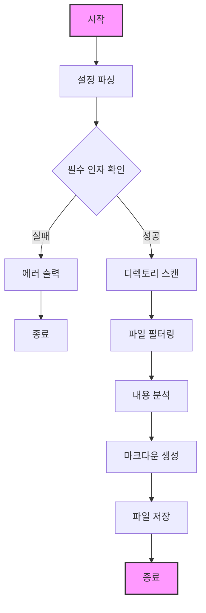

# AIMD (Auto Index Markdown Generator)

자동으로 프로젝트의 디렉토리 구조를 분석하여 마크다운 문서를 생성하는 도구입니다.

## 기능
- 지정된 확장자의 파일만 필터링
- 특정 디렉토리 제외 가능
- 커스텀 출력 경로 지정

## 빌드 방법

```bash
# 프로젝트 클론
git clone https://github.com/kihyun1998/aimd.git

# 프로젝트 디렉토리로 이동
cd aimd

# 빌드 
go build -o aimd ./cmd/aimd
```

## 사용법

```bash
# 기본 사용법
aimd -type go,java

# 출력 경로 지정
aimd -type go -out docs/index.md

# 특정 디렉토리 제외
aimd -type go -exclude vendor,node_modules
```

## 프로세스 Flow



## 프로젝트 구조
```
aimd/
├── cmd/
│   └── aimd/                # 실행 파일 디렉토리
│       └── main.go         
├── internal/
│   ├── config/             
│   ├── generator/           
│   └── parser/             
├── pkg/
│   └── utils/              
└── test/
    └── testdata/           
```